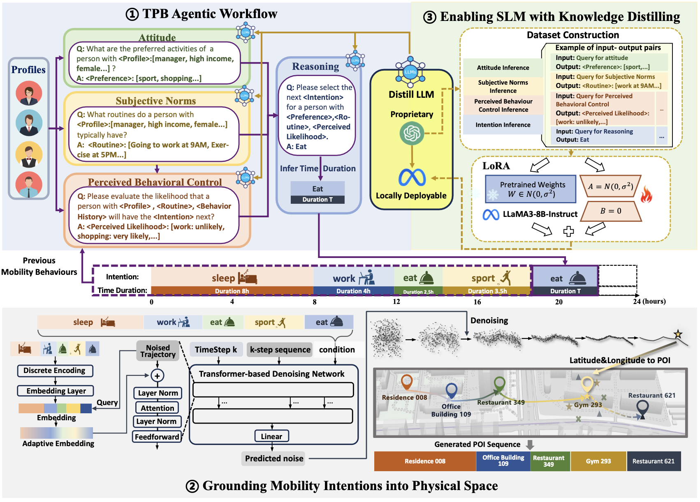

## Generating Realistic Human Mobility Data with Hybrid Large Language Model Agent




**:heart: Implementation of the "Generating Realistic Human Mobility Data with Hybrid Large Language Model Agent".** 


### :hammer:Environment Setup:

We provide a pre-configured `Dockerfile` that encapsulates our experimental environment. You can build and run the container to quickly replicate the exact software dependencies and settings used in our experiments. The following instructions will guide you through setting it up. 

**Prerequisites**: Before you begin, ensure you have the following installed on your system:

* [Docker](https://www.docker.com/get-started)
* [NVIDIA GPU Drivers](https://www.nvidia.com/Download/index.aspx)
* [NVIDIA Container Toolkit](https://docs.nvidia.com/datacenter/cloud-native/container-toolkit/latest/install-guide.html) (to enable GPU access within Docker containers)

**Follow these steps to build the Docker image and run the container.**

**1. Clone the Repository**

```bash
git clone https://github.com/PLUTO-SCY/CoPB
cd CoPB
```

**2. Build the Docker Image**

From the root directory of the project (where the `Dockerfile` is located), run the following command. This will build the Docker image and install all dependencies from the `environment.yml` file. This process may take a significant amount of time.

```bash
docker build -t copb:latest .
```
* `-t copb:latest` tags the image with a memorable name (e.g., `copb-image`).

**3. Run the Docker Container**

Once the image is built, you can start a container to enter the environment.

```bash
docker run --gpus all -it --rm \
  -v "$(pwd)":/app \
  my-project-image:latest
```

* `--gpus all`: Grants the container access to all available host GPUs.
* `-it`: Starts the container in interactive mode with a pseudo-TTY.
* `--rm`: Automatically removes the container when you exit.
* `-v "$(pwd)":/app`: Mounts the current directory on your host machine to the `/app` directory inside the container. This allows you to edit code locally and have the changes reflected inside the container instantly.

After running this command, you will be inside the container's `bash` shell. The Conda environment is already activated, and you can immediately start running.

:triangular_flag_on_post:**Manual Environment Setup (conda + pip):**

In addition to the provided `Dockerfile`, we also offer a `requirements.txt` file for users who prefer to set up the environment manually. This allows for easy environment setup using `conda` to create a base Python environment and `pip` to install the required packages.

1. **Create a new Conda environment**

We recommend creating a clean environment with Python 3.11:

```bash
conda create -n myenv python=3.11
conda activate myenv
```

**2. Install Python dependencies via `requirements.txt`**

Make sure you are in the root directory of the project, then run:

```bash
pip install --upgrade pip
pip install -r requirements.txt
```

For generating intention sequences with LLMs, you should first set your openai key in function: 'setOpenAi'  (in CoPB/utils.py) 


### :star2: Using CoPB to Generate Intention-aware Trajectories:

We provide a complete pipeline for generating **intention-aware trajectories** based on semantic user intentions, using either a **diffusion-based model** or a **lightweight gravity-based approach**.

------

**Step 1: Generate Day-level Intention Templates**

This step produces abstract user intention representations (i.e., daily templates) based on temporal patterns and semantic information.

```bash
python genDayIntention_TPB.py --TemplateRes_PATH TemplateRes
```

> Output: `TemplateRes/` will contain structured templates used to guide downstream trajectory generation.

------

**Step 2A: Generate Trajectories Using Diffusion Model**

Our diffusion-based model leverages denoising techniques to model fine-grained spatiotemporal mobility patterns.

```bash
# Generate trajectories on different datasets
CUDA_VISIBLE_DEVICES=0 python main.py --epochs 100001 --expIndex 0 --denoise queryonce --dataset foursquare
CUDA_VISIBLE_DEVICES=1 python main.py --epochs 100001 --expIndex 1 --denoise queryonce --dataset tencent
CUDA_VISIBLE_DEVICES=2 python main.py --epochs 100001 --expIndex 2 --denoise queryonce --dataset chinamobile
```

Each run will produce generated trajectory data in the corresponding output directory.

> Parameters:
>
> - `--epochs`: Total training iterations
> - `--expIndex`: Experiment ID (for logging and checkpointing)
> - `--denoise`: Diffusion denoising strategy
> - `--dataset`: Target dataset name

**Evaluate Diffusion-generated Trajectories**

```bash
cd DLModel/Eval

python eval_foursquare.py
python eval_tencent.py
python eval_mobile.py
```

------

**Step 2B: Generate Trajectories Using Gravity Model (Lightweight Baseline)**

For fast and interpretable trajectory generation, you can use our gravity model implementation:

```bash
# Generate synthetic trajectories from templates
python genTraceGravity.py --Template_PATH TemplateRes --Trajectory_PATH TrajectoryRes

# Evaluate generated trajectories
python eval.py --trajPath TrajectoryRes
```


### :open_file_folder: Mobility Datasets: 

We have open-sourced a dataset of **100,000 Intention-aware Trajectories** generated using **CoPB**, to facilitate future research in this area. In addition, all datasets used in this paper are publicly available, including the proprietary **Tencent** and **ChinaMobile** datasets used in our experiments. The access methods are as follows:

- **Dataset generated by CoPB:**
- **Tencent dataset**: link: https://pan.baidu.com/s/1K4pUhIiBu7RsAmfoqwF5cg?pwd=821m  with password: 821m
- **ChinaMobile dataset**: link: https://pan.baidu.com/s/1HHOgze1Hse7xfb4VGyRI7A?pwd=tyb9 with password: tyb9
- **Foursquare dataset**: You can acquire from https://sites.google.com/site/yangdingqi/home/foursquare-datasetchi which was collected by Dingqi Yang.


### :sparkles: Fine-tuning Setup and Usage of Lightweight LLaMA 3-8B:

To reduce the cost associated with calling large-scale proprietary model APIs, we propose a knowledge distillation approach to fine-tune a lightweight LLaMA3-8B model as a substitute for performing intention inference. After fine-tuning, the LLaMA3-8B model achieves performance comparable to that of the proprietary model on the intention reasoning task.

**Dataset and Model Checkpoints**
The dataset for fine-tuning is located at:  `LLaMA_Finetune/Dataset`

The fine-tuned model parameters are saved in:  `LLaMA_Finetune/training_save`

**Merging Fine-tuned Parameters**
 To use the fine-tuned parameters, you need to merge them with the original LLaMA3-8B model checkpoint. Please follow the official guide:   [LLaMA-Factory Merge Instructions](https://github.com/hiyouga/LLaMA-Factory/blob/main/examples/README.md)

**Training Configuration**
 The specific training configuration used in our experiments is provided in:  `CoPB/LLaMA_Finetune/llama3_lora_sft.yaml`
 You can use this file directly after updating any local file paths.

**Using Your Own Dataset**
 To fine-tune LLaMA3-8B with your own dataset, please refer to the official documentation of LLaMA-Factory for detailed setup and customization:
 [LLaMA-Factory Official Documentation](https://github.com/hiyouga/LLaMA-Factory/tree/main)


###  :thumbsup: Acknowledgements
- We gratefully acknowledge the excellent work of [LLaMA-Factory](https://github.com/hiyouga/LLaMA-Factory/tree/main), which forms the backbone of our fine-tuning pipeline.
- We also thank [lucidrains/denoising-diffusion-pytorch](https://github.com/lucidrains/denoising-diffusion-pytorch) for providing a well-designed and extensible diffusion framework, which significantly facilitated the development of our own diffusion models.

